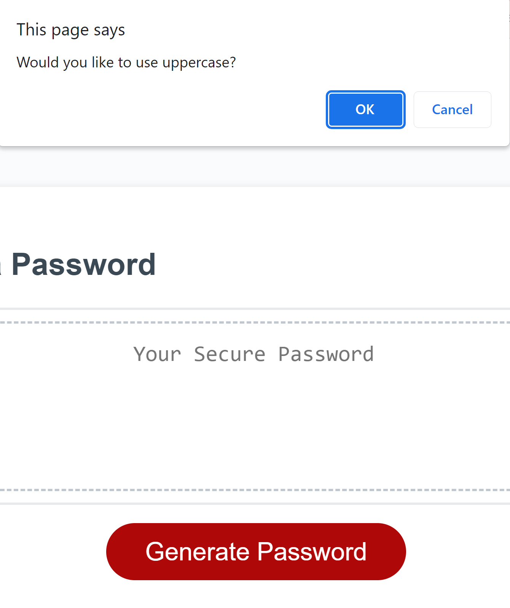
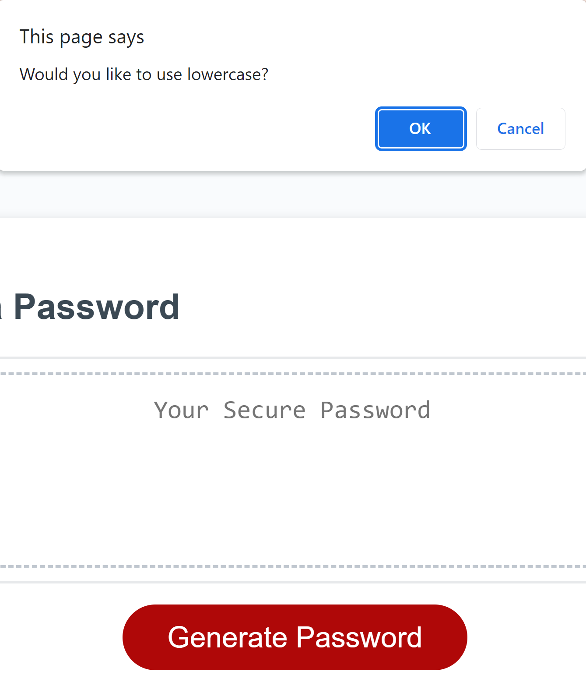
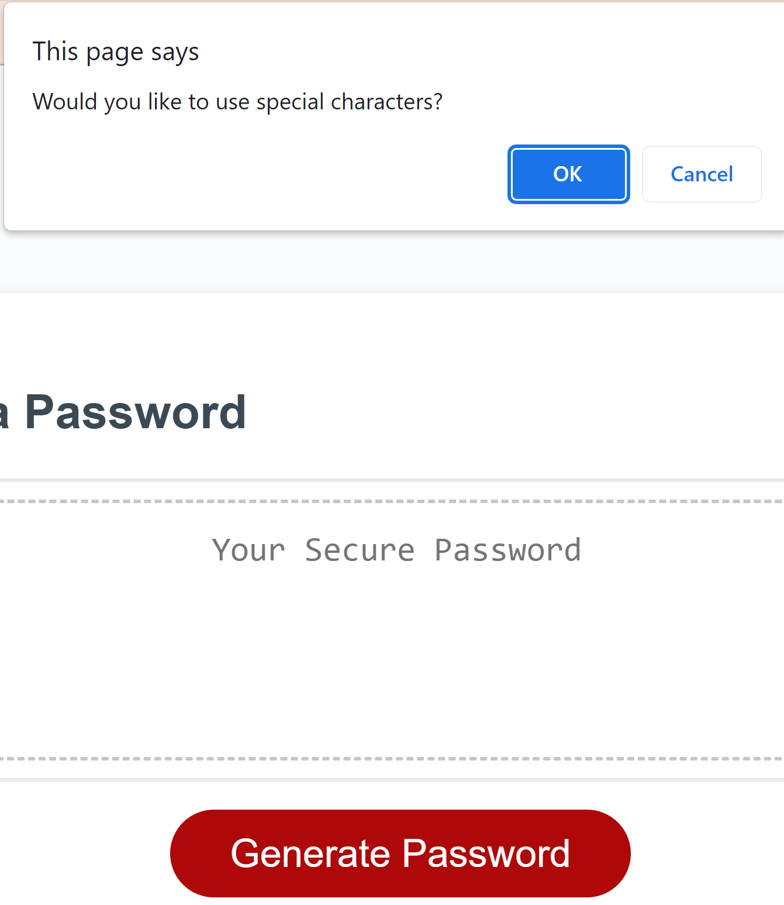

# Password

[My Project](https://dquiroz80.github.io/Password/)

## Table Of Contents

- [Description](#description)
- [Visual](#visual)

## Description

This is the first time learning, using and understanding javascript.  I created a password generator that will generate a random passwod using uppercase letters and/or lowercase letter and/or special characters and/or numbers.  It is up to the user which ones they would like to use.  It will also make the user choose between 8 - 128 characters for the length of the password.

    

## Visual

